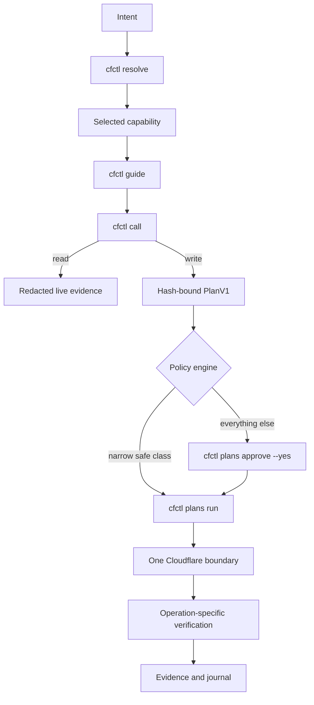

# cfctl v2

`cfctl` is a universal, governed Cloudflare control plane for macOS and Linux.
It is an open-source Rust CLI with no MCP dependency, accepts natural-language
intent through a configured local agent, and exposes deterministic commands
with stable JSON for automation.

```bash
./bootstrap.sh
cfctl version --json
cfctl doctor --json
cfctl agents doctor --json
cfctl catalog sync
cfctl resolve "rotate a Worker secret"
cfctl catalog search "Worker secret"
cfctl guide worker-put-script-secret
cfctl "rotate the production Worker secret"
```

Every mutation follows one governed loop — deterministic resolution, a
reviewed hash-bound plan, explicit or policy authority, one Cloudflare
boundary, then operation-specific verification:



<!-- BEGIN CFCTL GENERATED: system-guide -->
## How cfctl works

cfctl is a local-first, catalog-driven control plane: it separates intent, live reads, durable authority, one Cloudflare boundary, verification, and evidence.

**Will this mutate Cloudflare now?** Discovery, guides, workspace inspection, and read capabilities do not write Cloudflare. A mutating `cfctl call` creates a plan; `cfctl plans run` is the normal write boundary. A token command with `--under-policy` may plan and run in one invocation only under an explicitly approved standing authority. Agent output, guide output, and approval alone do not mutate Cloudflare.

**What grants authority?** The deterministic policy engine grants automatic admission only to the narrow safe class. Otherwise authority is either explicit approval of one reviewed operation ID or explicit approval of one bounded standing token policy. A model never grants authority.

**What is persisted?** Under its managed state root, cfctl persists profile metadata, the live CapabilityV1 catalog and official-doc caches, workspace registrations and imports, plans, approval and admission checkpoints, transaction journals, standing-authority records, locks, and redacted evidence. Credential values remain in the platform secret store or an explicit mode-0600 sink. The source checkout's compat/v1 tree is inert migration evidence, not runtime state or a live catalog.

**What happens after a failure or crash?** Once consumption or a boundary attempt is durable, cfctl never guesses that replay is safe. Inspect `plans status`; use `plans rectify` to reconcile durable receipts and verification without replaying the original Cloudflare mutation.

**What should I do next?** Run `cfctl version --json` and both doctors before work; running-build, PATH-build, or managed-instruction drift is unhealthy. Read token permissions only with an explicit account context (`keys permissions --account`, adding `--user` only to select user ownership). Nested fixture basenames are skipped during broader workspace scans; fixture directories are opt-in roots and must be registered directly. Then resolve the intent deterministically (`cfctl resolve`), browse with `cfctl catalog search` only when exploring, and inspect the selected capability and its capability-specific guide before calling it.

### Lifecycle

1. **Orient** (`none`) — Check running and PATH build identity, local state, credentials, catalog health, and agent integration.
2. **Discover** (`none`) — Resolve the intent to the catalog-selected capability and adapter; browse the catalog when exploring.
3. **Read** (`read`) — Inspect exact live Cloudflare state and registered-workspace impact. Durable state: redacted live-read and source-config evidence
4. **Plan** (`none`) — Bind the request, account, catalog, impact, cost, verification, and compensation contracts. Durable state: hash-bound PlanV1 and PlanPrepared checkpoint
5. **Admit** (`none`) — Apply policy, bind any explicit approval, acquire locks, and recheck drift. Durable state: approval, standing reservation, and consumption checkpoints
6. **Execute** (`write`) — Persist the boundary attempt, then cross exactly one catalog-selected adapter boundary. Durable state: boundary-attempt and response checkpoints
7. **Verify** (`read`) — Run the operation-specific verifier or record why rectification is required. Durable state: sink and verification receipts
8. **Close or rectify** (`none`) — Close with evidence or reconcile the durable journal; any compensation is a new plan with independent authority. Durable state: terminal plan status and content-addressed evidence

### Commands

```bash
cfctl version --json
cfctl doctor --json
cfctl agents doctor --json
cfctl keys permissions --account <account-id> --json
cfctl keys permissions --user --account <account-id> --json
cfctl guide --topic standing-authority --json
cfctl resolve <intent> --json
cfctl catalog search <intent> --json
cfctl catalog show <capability-id> --json
cfctl guide <capability-id> --json
cfctl call <capability-id> --json
cfctl plans show <operation-id> --json
cfctl plans approve <operation-id> --yes --json
cfctl plans run <operation-id> --json
cfctl plans status <operation-id> --json
cfctl plans rectify <operation-id> --json
```
<!-- END CFCTL GENERATED: system-guide -->

## What it covers

Catalog refresh ingests Cloudflare's official OpenAPI schema, OAuth permission
inventory when authenticated, official docs/changelog feeds, installed
Wrangler help, and installed cloudflared help. Every operation is discoverable
and classified as `native`, `dynamic_api`, `delegated_cli`, `governed_ui`, or
`blocked` with an exact reason. "Universal" means honest discovery and
classification: entitlement, missing permission, unavailable adapters, unknown
cost, and unsupported verification remain visible blockers.

`catalog coverage` reports entitlement, pricing-reference, verification, and
rollback coverage separately, plus stable, searchable mutation-gap classes
such as `risk_unknown`, `cost_unbounded`, and `verification_missing`. Official
product pricing references identify usage, subscription, pass-through, or
contract exposure without pretending a variable downstream bill is a hard
execution ceiling. Verification and rollback strategy names are executable
contracts, not prose: only strategies implemented by the runtime for the
capability's exact method, identity, and resource shape count as complete, and
the Cloudflare adapter repeats the verifier check before sending a mutation.

## Public commands

```text
cfctl "<natural-language request>"
cfctl version
cfctl auth login|status|profiles|use|logout|import-api-token|import-global-key
cfctl keys permissions|mint|rotate|revoke|policy
cfctl keys policy create|list|approve|revoke
cfctl catalog sync|search|show|changes|coverage
cfctl resolve "<natural-language intent>"
cfctl call <capability-id> [selectors/body]
cfctl guide <capability-id>
cfctl guide --topic system|standing-authority
cfctl plans show|approve|run|status|resume|rectify
cfctl workspace add|discover|graph|audit
cfctl agents install|doctor|sync
cfctl docs search|changes|coverage
cfctl doctor
cfctl update
cfctl migrate v1
```

Every command has concise human output and stable `--json` output. The public
contracts are `BuildInfoV1`, `CapabilityV1`, `CapabilityGuideV1`,
`GuideTopicDocumentV1`, `PlanV1`, `PolicyDecisionV1`, `AgentActionV1`,
`EvidenceV1`, and `ResultEnvelopeV2`.

## Authentication

Day-to-day auth is a scoped API token, imported only through stdin (never
argv). The token lives in the platform keyring — Keychain on macOS, Secret
Service on Linux — and automatically falls back to a mode-0600 file store under
the cfctl data dir when the keyring is unavailable; `cfctl doctor` reports which
backend is active. The account pin is required:

```bash
printf '%s' "$CLOUDFLARE_API_TOKEN" | \
  cfctl auth import-api-token --account <account-id> --stdin
```

If you drive cfctl through a wrapper that routes stdin through `cargo` (the
in-repo `./cfctl` shim does), pass a new mode-0600 file with `--value-in`
instead so the secret never touches stdin.

OAuth Authorization Code with PKCE remains available when you have a
Cloudflare OAuth client (`--client-id` / `CFCTL_OAUTH_CLIENT_ID`); public
cfctl OAuth is not the default until cfctl.io ownership and permanent
promotion complete, and public clients never embed a client secret. An
emergency global key can be imported with `cfctl auth import-global-key`
(stdin or `--value-in`); it is never selected silently. `CFCTL_FORCE_IPV4=1`
pins outbound Cloudflare API calls to an IPv4 source so an IP-allowlisted
token keeps working when the host default-routes over IPv6; it is off by
default.

## Read and change

```bash
cfctl call zones-get --query name=example.com --json
cfctl guide dns-records-for-a-zone-create-dns-record
cfctl call dns-records-for-a-zone-create-dns-record \
  --selector zone_id=<zone-id> \
  --body-json '{"type":"TXT","name":"_example","content":"hello"}'
```

`guide --json` returns the exact 15-stage lifecycle with contract states,
evidence classes, blockers, safe next actions, and argv arrays; a blocked
capability never receives a runnable `call_argv`. Token creation is exposed
through the inventory-bound `keys mint` workflow, never a direct create call.

A mutating `call` creates a hash-bound transaction plan. It does not write
immediately. Review the plan and exact operation ID:

```bash
cfctl plans show <operation-id> --json
cfctl plans approve <operation-id> --yes --json
cfctl plans run <operation-id> --json
cfctl plans status <operation-id> --json
```

Known, scoped, reversible, isolated operations may be policy-authorized to run
without a separate approval. Deletes, purges, identity/security/ownership
changes, external sends, registrar/billing actions, irreversible data changes,
unknown semantics, cross-repository impact, and paid actions require approval.
Paid plans also require `--max-cost CURRENCY:AMOUNT`; unknown or unbounded
downstream cost is blocked even when an official pricing page is available.
The full classification contract is [docs/runtime-policy.md](docs/runtime-policy.md).

Plans bind the derived executable-catalog hash, account, permission lane,
exact request, workspace graph, source configuration, impact, costs,
verification, compensation, and warnings. They expire within 24 hours, and
drift invalidates approval. A hash-chained transaction journal persists every
checkpoint from reviewed plan through close; changing a status, returned
resource ID, or evidence hash invalidates the journal, and a plan durably
consumed before a crash cannot be replayed — inspect `plans status` and
reconcile with `plans rectify` instead of retrying.

Executable mutations carry operation-specific safety contracts on top of that
loop: fresh live zone-ownership and plan-entitlement reads that are hash-bound
and repeated before durable consumption, owner-specific permission-inventory
binding for `keys mint`, exact-readback verification for DNS and settings
writes, explicitly allowlisted Access service-token and Turnstile lifecycles,
two-phase OAuth client-secret rotation, and compensation that is always a
separate reviewed plan — never automatic. Generated write capabilities stay
blocked until risk, cost, entitlement, permissions, verification, and rollback
or irreversibility are known, so catalog coverage is broader than executable
write coverage by design. The complete per-capability invariants are
[docs/v2-security.md](docs/v2-security.md).

## Secrets

Secret inputs enter through stdin and become opaque platform-key-store
references. Secret-producing calls require a new file sink, created mode 0600
on Unix:

```bash
cfctl call cloudflare-tunnel-get-a-cloudflare-tunnel-token \
  --selector account_id=<account-id> \
  --selector tunnel_id=<tunnel-id> \
  --value-out /tmp/tunnel-token
```

Raw values never enter stdout, plans, logs, delegated subprocess receipts, or
evidence.

## Workspaces and agents

Registered roots bound all discovery:

```bash
cfctl workspace add /absolute/repository/root --account <account-id>
cfctl workspace discover --json
cfctl workspace graph --json
cfctl workspace audit --json
```

Discovery inventories Git repositories even when they contain no Cloudflare
configuration. Supported files are Wrangler TOML/JSON/JSONC, Terraform
HCL/JSON, and Pulumi YAML, each linked to catalog targets with
current-content, `HEAD`-content, and exact worktree-diff hashes so dirty or
unmanaged dependencies remain visible in a plan. Nested directories named
`fixtures`, `__fixtures__`, `testdata`, `test-data`, or `test_data` are
excluded from broader scans; register a fixture directory itself when its
contents are intentional workspace evidence.

Install managed instructions for detected local agents:

```bash
cfctl agents install --all-detected
cfctl agents doctor
```

`version --json` exposes the invoked binary's build identity. `doctor` and
`agents doctor` trust the PATH build only when it resolves to that same
executable; a missing or different PATH executable and drifted managed
instructions are unhealthy.

Natural language launches the configured agent once; `CFCTL_AGENT` selects the
delegated agent binary (default `codex`; also `claude`, `cursor`, or
`gemini`). The agent translates intent into a deterministic `cfctl resolve`
match — `cfctl catalog search` is the browse fallback — and governed commands;
model output never grants authority or directly mutates Cloudflare. Quote
natural language: a bare single token that is not a known command fails closed
with a usage error and a did-you-mean, so a typo is never an agent launch.
Browser or Computer Use is available only for cataloged `governed_ui`
capabilities after API/CLI coverage cannot finish the task, under the same
account binding, redaction, approval, and evidence rules.

## Evidence and migration

Meaningful operations leave redacted, content-addressed local evidence, with
evidence class distinguishing source config, live reads, plans, applies,
post-change verification, agent actions, and local proof. Artifact presence is
not verification.

`cfctl migrate v1` copies safe desired state and non-secret evidence into
content-addressed imports; it skips secret-shaped paths/content and never
imports credentials implicitly. This checkout's retained v1 data is
quarantined under [`compat/v1/`](compat/v1/README.md); the live v2 catalog is
managed under `CFCTL_HOME`, not loaded from that retained tree.

## Development and release

Rust 1.93 is pinned. The local proof lane is:

```bash
cargo xtask verify
```

The proof host also needs `cargo-deny` and Gitleaks; the lane rejects yanked
dependencies, unreviewed licenses or sources, unversioned dependency edges,
and secret findings across the complete Git history.

The assembly lane (`cargo xtask assemble`) builds Apple arm64/x86_64 and Linux
musl arm64/x86_64 twice, compares hashes, creates SPDX SBOMs and provenance,
and renders the Homebrew formula and checksum-verifying Linux installer; it
deliberately stops before identity-bearing Apple or Sigstore activity. The
signing lane (`cargo xtask release`) repeats that proof, signs and notarizes
both macOS binaries against explicit operator-supplied identities, and signs
checksums and provenance; `cargo xtask publish` rechecks every identity and
uploads the complete four-platform set, one asset at a time, to an empty draft
release. Making the draft public remains a separate operator action.

The signed lane above is available tooling, not the current publishing
posture: published releases are unsigned by operator decision, with integrity
provided by `SHA256SUMS`, reproducible double-builds, SPDX SBOMs, and
commit-bound provenance. Because the rendered Linux installer verifies a
Cosign identity and has no checksum-only fallback, it is deliberately not
shipped with unsigned releases — install by direct download plus checksum
verification, the release's Homebrew formula, or source build.
GitHub-hosted Rust builds are intentionally absent.

An account-backed disposable token smoke test (`tests/account-backed-smoke.sh`)
is intentionally separate from the local proof lane because it mutates a real
account; it requires an explicit disposable account, profile, reviewed
permission group, and acknowledgement gate before it mints, rotates, revokes,
and verifies one short-lived token.

## External activation boundary

`cfctl.io` registration, site publication, publisher-domain verification,
permanent Cloudflare OAuth promotion, and public release publication require
explicit operator action. The project/privacy/terms/logo/callback site is ready
under `site/`; these external steps are not silently performed or claimed.

- [Quickstart](QUICKSTART.md) — install, first commands, first governed write
- [Architecture](docs/v2-architecture.md) — crates, boundaries, trust sequence
- [Runtime policy](docs/runtime-policy.md) — plan classification and approval
- [Security contract](docs/v2-security.md) — secrets, hashing, invariants
- [Agent landing](docs/agent-landing.md) — first-load agent doctrine
- [v1 parity and shell-removal audit](docs/v1-parity.md)
- [Rust clean-break ADR](docs/architecture/adr/0001-rust-clean-break.md)
- [Risk-based approval ADR](docs/architecture/adr/0002-risk-based-approval.md)
- [Executable guidance projection ADR](docs/architecture/adr/0003-executable-guidance-projection.md)
