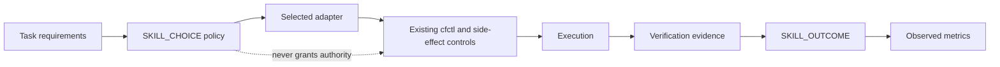

# SKILL_CHOICE Architecture

## Problem

Cloudflare work can be reached through native cfctl surfaces, dynamic API
discovery, Wrangler, cloudflared, browser automation, or an existing signed-in
UI. Picking the most powerful tool by intuition is unsafe: tool availability,
coverage, and convenience do not grant mutation authority or prove success.

## Goals

- Select the safest executable adapter that satisfies explicit risk and
  capability requirements.
- Cover uncatalogued API and dashboard-only work without bypassing cfctl.
- Persist a privacy-preserving choice receipt and evidence-backed outcomes.
- Keep declared routing policy distinct from observed performance.
- Make blocked capability gaps explicit enough to drive the next runtime
  extension.

## Non-goals

- Granting permissions or approving side effects.
- Treating a high score as evidence of successful execution.
- Sending raw task text, credentials, or private payloads into artifacts.
- Making desired state universal or claiming every Cloudflare operation is
  currently preview-gated.

## Public Contract

```bash
cfctl skills list
cfctl skills choose --intent <non-secret-text> --risk <class> --need <capability> [--available <adapter>]
cfctl skills record --choice-id <id> --adapter <id> --outcome verified|failed|fallback|abandoned --duration-ms <n> [--evidence <path> --evidence-class <class>]
cfctl skills metrics
```

The catalog is [catalog/skill-choices.json](../catalog/skill-choices.json). The
agent workflow is [skills/cfctl-operator/SKILL.md](../skills/cfctl-operator/SKILL.md).

## Decision Model

An adapter is eligible only when it supports the requested risk and every
`--need`. It is executable only when built in or truthfully declared available
in the active session. Candidates are ordered by:

1. eligibility
2. executable availability
3. weighted policy score
4. explicit priority
5. stable adapter id

Weights sum to 100. Every component is a 0-100 declared policy value:

| Metric | Meaning |
|---|---|
| exactness | Ability to target the requested operation precisely |
| safety | Strength of policy, scoping, redaction, and confirmation boundaries |
| verification | Quality of post-action readback and proof |
| coverage | Breadth of tasks the adapter can reach |
| latency_efficiency | Relative time efficiency for the task class |
| cost_efficiency | Relative resource and service-cost efficiency |
| maturity | Operational stability of the adapter path |

These metrics route work; they do not assert observed quality.

## Receipt Model

`SKILL_CHOICE` records:

- choice id and schema version
- SHA-256 intent digest and character count, with raw intent set to null
- risk, capability needs, surface, and declared available adapters
- catalog digest and metric class
- ranked candidates with component scores and weights
- selected adapter, executable state, reason codes, controls, invocation, and
  fallback order
- explicit false values for authority and bypass grants

`SKILL_OUTCOME` references the choice, actual adapter, outcome, caller-measured
duration, and content-addressed evidence. A verified outcome requires a separate
file, evidence class, SHA-256 digest, and size. A choice receipt cannot prove
itself, and only one outcome may be recorded per choice.

`SKILL_METRICS` aggregates only one recorded outcome per choice. For each
adapter it reports attempts, outcome counts, observed success rate, mean
duration, and the current declared policy score. Verified counts are accepted
only while the evidence file's current SHA-256 still matches the receipt;
duplicates and invalid evidence are reported separately. Rates remain null
until at least one outcome exists.

## Authority Boundary



The choice layer cannot disable lane policy, targeting, preview/ack,
destructive confirmation, external side-effect confirmation, secret handling,
or verification.

## Dynamic API And UI Rules

- Cloudflare API MCP may discover current endpoints and perform allowed reads.
  An uncatalogued mutation remains blocked until cfctl has an operation-specific
  preview, acknowledgement, redaction, and verification contract.
- Prefer Browser Run or another purpose-built browser adapter for web state.
- Use Computer Use only as a bounded fallback for signed-in dashboard or native
  UI state. Capture page/window identity plus before/after evidence.
- If a UI is the only write path and cfctl cannot preview it, extend cfctl; do
  not reinterpret the choice receipt as approval.

## Risks And Mitigations

- **Metric gaming:** declared and observed metric classes are structurally
  separate; verified records require evidence.
- **Intent leakage:** raw intent is omitted from receipts. Operators must still
  keep secrets out of command arguments and shell history.
- **Availability bluffing:** adapters are executable only when built in or
  explicitly declared present for the active session.
- **Coverage theater:** blocked decisions name missing capabilities instead of
  selecting an ineligible adapter.
- **UI authority inflation:** Computer Use receives the same controls and lower
  safety/exactness scores than native paths.

## Acceptance Proof

`scripts/verify_skill_choice_contract.sh` verifies catalog shape, deterministic
dynamic-API and Computer Use choices, authority invariants, raw-intent omission,
outcome recording, observed metrics, skill presence, and embedding-prompt
alignment. It is included in `scripts/verify_static_contract.sh`.
