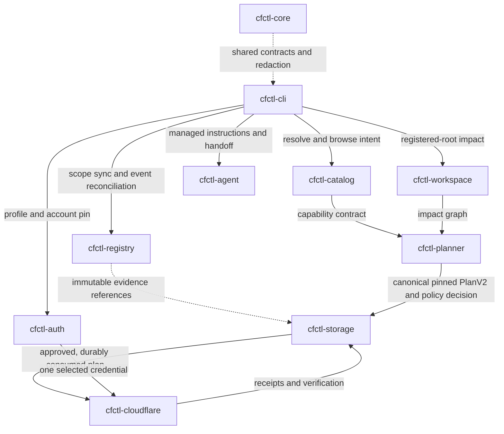

# cfctl v2 architecture

`cfctl` v2 is a local-first, catalog-driven Cloudflare control plane with no
MCP dependency. `cfctl-cli` orchestrates; each other crate owns one boundary,
and every crate shares the `cfctl-core` contracts, hashing, and redaction. A
governed write flows through the crates like this:

| Crate | Boundary |
|---|---|
| `cfctl-cli` | Public command parser, human/JSON rendering, orchestration |
| `cfctl-core` | Versioned contracts, hashes, evidence, redaction, plan lifecycle |
| `cfctl-auth` | OAuth PKCE, profiles, account selection, Keychain/Secret Service with mode-0600 file fallback |
| `cfctl-cloudflare` | Schema-validated HTTP execution, retries, pagination, conditionals, and idempotency |
| `cfctl-catalog` | Official OpenAPI/docs/changelog/CLI ingestion and SQLite search index |
| `cfctl-planner` | Risk, impact, cost, and approval policy |
| `cfctl-workspace` | Registered-root Git/IaC discovery, exact local diffs, and repository/resource graph |
| `cfctl-agent` | Agent discovery, maintained instructions, recursion-safe handoff |
| `cfctl-storage` | Platform paths, atomic plans, locks, content-addressed evidence, tamper-evident operational-proof rows, and bounded recent-proof projections |
| `cfctl-registry` | Rebuildable SQLite projection for scopes, normalized resources, observations, desired declarations, ownership, provider coverage, events, authorities, and operation maturity |
| `xtask` | Local verification, reproducible release assembly, publication |

The binary exposes a timestamp-free `BuildInfoV1`. A checkout build embeds its
full `HEAD` commit only when Git reports no tracked or untracked non-ignored
changes; Cargo watches those repository inputs plus the Git index and `HEAD` so
a later edit invalidates the embedded identity. A verified release build may
instead inject the same full commit through the release environment. Any
missing, malformed, or unknown source identity is reported as unhealthy by
both doctor surfaces even when PATH resolves to the running executable.

## Adapter boundary

Every capability is classified as `native`, `dynamic_api`, `delegated_cli`,
`governed_ui`, or `blocked`; the adapter is selected by catalog data, never
inferred from model output. Generated API writes are executable only when
their operation contract is complete; reads remain dynamically executable, and
incomplete writes stay searchable with every missing contract field explained.

Adapter selection is separate from authority ownership. Catalog schema v2
classifies every newly built capability as `provider_generic`, `cfctl_product`,
`workspace_owned`, or `legacy_embedded`. Generic provider contracts must remain
portable across application repositories. cfctl-product contracts may describe
cfctl's own site, OAuth identity, and release surface, but cannot absorb another
product's source or deployment policy. Workspace-owned operations belong in a
future typed, hash-bound operation pack loaded from an explicitly registered
root; inserting one directly into the provider catalog fails closed.

Five pre-operation-pack D1 contracts are acknowledged as frozen
`legacy_embedded` migration debt: two MLNavigator schema proofs, its approved
import and poll continuation, and the approved OSINT Research Center import.
The catalog validates their exact ids and contract shapes, reports the authority
classes in `catalog coverage`, and rejects a new legacy id without an explicit
allowlist change. This classification does not publish either application
repository and does not grant new execution authority. The migration sequence
is consumer-first: define and validate the workspace operation-pack format,
adopt it in each owning repository, prove plan and receipt compatibility, then
remove the compiled projection and its frozen exception.

Most of the catalog is therefore inventory, not capability: the large majority
of mutating operations are unexecutable because their contracts are
incomplete, and only a governed core carries complete risk, effect, cost,
verification, and rollback metadata. That ratio is the gate
holding, not neglect — but it is deliberate **contract debt**, and closing it
is per-capability review work, never a bulk default. `cfctl catalog coverage
--json` is the measure: it reports the executable core, the blocked remainder,
and the per-field gap counts. A capability graduates only when a change
supplies its full mutation contract with tests and documentation together, the
way `wrangler.deploy` was classified.

OpenAPI parameter selectors resolve local `$ref` chains, homogeneous enum
values, and compatible value types carried through `allOf`, `oneOf`, or
`anyOf`; empty, mixed, or conflicting shapes stay explicitly `unknown`, and
normalization never guesses a type from a parameter name. Verification and
automatic rollback strategies form a closed runtime set bound to the exact
operation identity and resource shape — a plausible but incompatible strategy
is contract debt, not execution authority — and the adapter validates the
verifier again before network mutation.

## Workspace and transaction model

Workspace discovery never scans outside explicitly registered roots. It finds
configless Git repositories and parses Wrangler TOML/JSONC, Terraform, and
Pulumi files while excluding generated and vendor directories (the README
lists the exact supported representations). Every source-config snapshot
records the current hash, `HEAD` hash, exact worktree-diff hash, and dirty
status. Terraform and Pulumi runtime
identity links come only from literal, resource-type-specific properties;
dynamic expressions and local binding symbols never masquerade as Cloudflare
identities.

`workspace audit` joins an explicitly account-pinned repository only to
operational-proof rows for that same account. The overlay reports observed
capabilities and current-catalog outcomes but preserves the truth boundary:
checked-in configuration remains source-config evidence, receipts remain live-
read evidence, and neither is silently promoted to desired-state or edge
verification.

Canonical `PlanV2` binds the compatible `PlanV1` transaction journal to build,
catalog, credential generation, admission policy, workspace, observation, and
cost pins. The journal checkpoints distinguish
the point before a Cloudflare boundary from the persisted response, secret
sink, and operation-specific verification, so a network failure after a
boundary attempt enters rectification and cannot be mistaken for a safe retry.
Each checkpoint hash includes the plan status, and the storage boundary
validates the journal on both writes and reads. The storage crash matrix drops
volatile state and reopens the real local store between each journal
transition, proving recovery at every persisted stage; it does not claim
account-backed network mutation proof.

Live reads also write `OperationalProofV1` index rows beside their immutable
evidence. Each row binds the capability, catalog hash, redacted input hash,
profile/account scope, captured credential generation, outcome, and receipt.
Login or import assigns a new opaque generation without persisting a
secret-derived verifier. Credential replacement first persists an unbound
profile, writes the secret, and only then commits the new generation; an
interrupted or failed replacement therefore blocks proof-bearing reads instead
of inheriting the prior generation. Pre-generation profile metadata remains
unbound until the operator logs in or imports the credential again.
Catalog coverage projects rows separately from declared capability coverage.
Native workflow previews apply their own explicit maximum proof age, current
catalog identity, and currently installed credential generation. Historical
rows without a generation remain readable as `credential_unbound`, and a row
from a replaced credential is `credential_drifted`; neither becomes fresh
proof for the current profile.

The registry is a WAL-backed, rebuildable projection with versioned
migrations, foreign keys, integrity checks, atomic backups, and per-resource
writer locks. It keeps capability metadata, source configuration, desired
declarations, live observations, ownership, operations, token authorities, and event
receipts in separate truth domains. Queue messages are eligible for
acknowledgement only after their evidence and reconciliation jobs commit under
one ordinary, fully pinned event-batch PlanV2. Raw Queue pull and acknowledgement
remain blocked catalog operations. Redelivery deduplicates by upstream identity.
Events trigger bounded live reads; only a successful read may update an
observation, so Audit Logs and Event Subscriptions cannot masquerade as a
complete inventory.

## Trust sequence

1. Pin profile and account.
2. Pin the derived executable-catalog hash while retaining the upstream OpenAPI source hash separately.
3. Read registered workspace impact.
4. Bind the request, permission lane, workspace graph, source-config hashes, official pricing references, cost metadata, and exact plan content hash.
5. Apply policy and, when required, approve that operation ID.
6. Acquire the local operation lock.
7. Recheck drift, append the consumption checkpoint, and durably consume the plan.
8. Append the boundary-attempt checkpoint and cross one adapter boundary.
9. Persist the response and secret sink, then run the operation-specific verifier.
10. Close verified/rejected transactions or require rectification without replay.
11. Write redacted, content-addressed evidence.

Apply, sink, and verification receipts are hash-bound into their journal
checkpoints: they are outside the pre-execution approval hash but cannot
change after the boundary without invalidating the transaction chain, and a
supported rollback uses them only to create a new compensation plan with
independent authority.

## Executable guidance projection

The public explanation layer is a projection of the executable contracts, not
an independent architecture source. `cfctl-core` owns the typed
`CapabilityGuideV1` and versioned `GuideTopicDocumentV1` models, exposed
through `cfctl guide <capability-id>` and the additive
`cfctl guide --topic system|standing-authority` topics; static topics need no
catalog refresh or network access. The README and Quickstart embed canonical
Markdown rendered from those documents, managed agent instructions route
operators back to the same CLI topics, and `cargo xtask verify` compares each
generated section to the core renderer byte-for-byte, so lifecycle facts
cannot drift silently.

See [ADR 0001](architecture/adr/0001-rust-clean-break.md), [ADR 0002](architecture/adr/0002-risk-based-approval.md), and [ADR 0003](architecture/adr/0003-executable-guidance-projection.md).
