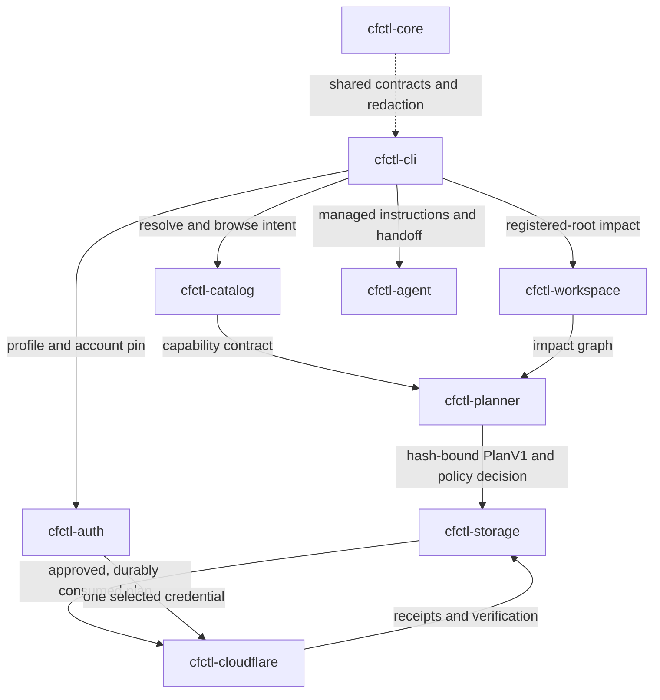

# cfctl v2 architecture

`cfctl` v2 is a local-first, catalog-driven Cloudflare control plane with no
MCP dependency. `cfctl-cli` orchestrates; each other crate owns one boundary,
and every crate shares the `cfctl-core` contracts, hashing, and redaction. A
governed write flows through the crates like this:

| Crate | Boundary |
|---|---|
| `cfctl-cli` | Public command parser, human/JSON rendering, orchestration |
| `cfctl-core` | Versioned contracts, hashes, evidence, redaction, plan lifecycle |
| `cfctl-auth` | OAuth PKCE, profiles, account selection, Keychain/Secret Service with mode-0600 file fallback |
| `cfctl-cloudflare` | Schema-validated HTTP execution, retries, pagination, conditionals, and idempotency |
| `cfctl-catalog` | Official OpenAPI/docs/changelog/CLI ingestion and SQLite search index |
| `cfctl-planner` | Risk, impact, cost, and approval policy |
| `cfctl-workspace` | Registered-root Git/IaC discovery, exact local diffs, and repository/resource graph |
| `cfctl-agent` | Agent discovery, maintained instructions, recursion-safe handoff |
| `cfctl-storage` | Platform paths, atomic plans, locks, content-addressed evidence |
| `xtask` | Local verification, reproducible release assembly, publication |

## Adapter boundary

Every capability is classified as `native`, `dynamic_api`, `delegated_cli`,
`governed_ui`, or `blocked`; the adapter is selected by catalog data, never
inferred from model output. Generated API writes are executable only when
their operation contract is complete; reads remain dynamically executable, and
incomplete writes stay searchable with every missing contract field explained.

OpenAPI parameter selectors resolve local `$ref` chains, homogeneous enum
values, and compatible value types carried through `allOf`, `oneOf`, or
`anyOf`; empty, mixed, or conflicting shapes stay explicitly `unknown`, and
normalization never guesses a type from a parameter name. Verification and
automatic rollback strategies form a closed runtime set bound to the exact
operation identity and resource shape — a plausible but incompatible strategy
is contract debt, not execution authority — and the adapter validates the
verifier again before network mutation.

## Workspace and transaction model

Workspace discovery never scans outside explicitly registered roots. It finds
configless Git repositories and parses Wrangler TOML/JSONC, Terraform, and
Pulumi files while excluding generated and vendor directories (the README
lists the exact supported representations). Every source-config snapshot
records the current hash, `HEAD` hash, exact worktree-diff hash, and dirty
status. Terraform and Pulumi runtime
identity links come only from literal, resource-type-specific properties;
dynamic expressions and local binding symbols never masquerade as Cloudflare
identities.

`PlanV1` carries a hash-chained transaction journal. Checkpoints distinguish
the point before a Cloudflare boundary from the persisted response, secret
sink, and operation-specific verification, so a network failure after a
boundary attempt enters rectification and cannot be mistaken for a safe retry.
Each checkpoint hash includes the plan status, and the storage boundary
validates the journal on both writes and reads. The storage crash matrix drops
volatile state and reopens the real local store between each journal
transition, proving recovery at every persisted stage; it does not claim
account-backed network mutation proof.

## Trust sequence

1. Pin profile and account.
2. Pin the derived executable-catalog hash while retaining the upstream OpenAPI source hash separately.
3. Read registered workspace impact.
4. Bind the request, permission lane, workspace graph, source-config hashes, official pricing references, cost metadata, and exact plan content hash.
5. Apply policy and, when required, approve that operation ID.
6. Acquire the local operation lock.
7. Recheck drift, append the consumption checkpoint, and durably consume the plan.
8. Append the boundary-attempt checkpoint and cross one adapter boundary.
9. Persist the response and secret sink, then run the operation-specific verifier.
10. Close verified/rejected transactions or require rectification without replay.
11. Write redacted, content-addressed evidence.

Apply, sink, and verification receipts are hash-bound into their journal
checkpoints: they are outside the pre-execution approval hash but cannot
change after the boundary without invalidating the transaction chain, and a
supported rollback uses them only to create a new compensation plan with
independent authority.

## Executable guidance projection

The public explanation layer is a projection of the executable contracts, not
an independent architecture source. `cfctl-core` owns the typed
`CapabilityGuideV1` and versioned `GuideTopicDocumentV1` models, exposed
through `cfctl guide <capability-id>` and the additive
`cfctl guide --topic system|standing-authority` topics; static topics need no
catalog refresh or network access. The README and Quickstart embed canonical
Markdown rendered from those documents, managed agent instructions route
operators back to the same CLI topics, and `cargo xtask verify` compares each
generated section to the core renderer byte-for-byte, so lifecycle facts
cannot drift silently.

See [ADR 0001](architecture/adr/0001-rust-clean-break.md), [ADR 0002](architecture/adr/0002-risk-based-approval.md), and [ADR 0003](architecture/adr/0003-executable-guidance-projection.md).
