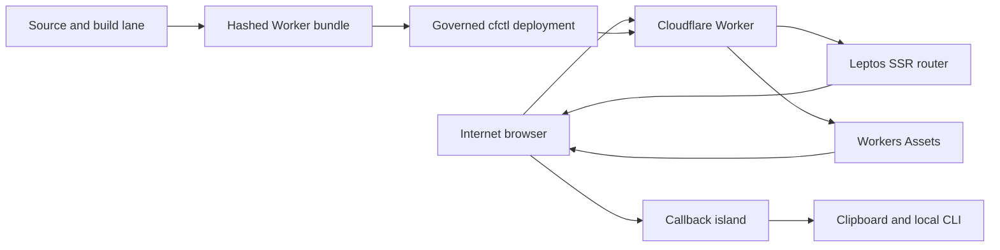

# cfctl Site Threat Model

## Executive summary

The highest-risk themes are OAuth callback confidentiality, integrity of the
published Worker and immutable assets, and truthful separation between a plan,
an apply, and live proof. The implemented site deliberately has no accounts,
forms, storage, analytics, runtime secrets, or third-party scripts; this sharply
limits server-side data risk but makes the callback island, response headers,
build pipeline, and governed deployment boundary the primary review targets.

## Scope and assumptions

- In scope: `site/src/`, `site/style/`, `site/assets/`, `site/scripts/`,
  `site/Cargo.toml`, `site/Cargo.lock`, `site/wrangler.toml`, and the generated
  Worker and asset bundle.
- Runtime: an internet-facing Rust/Leptos SSR Worker with Cloudflare Workers
  Assets. `fetch` accepts only GET and HEAD; most content is useful without
  hydration, while command-copy and `/oauth/callback` are client islands
  (`site/src/lib.rs::fetch`, `site/src/app.rs::App`).
- Confirmed product boundary: no user accounts, forms, database, KV, R2,
  Durable Objects, analytics, telemetry, runtime secrets, or third-party
  scripts. Adding any of these reopens this model (`site/SECURITY.md`,
  `site/wrangler.toml`, `site/scripts/verify-worker-runtime.mjs`).
- Deployment assumption: publish to an exact account-bound `workers.dev`
  preview first, validate live headers, routes, and assets, then bind a custom
  domain through a separate account-pinned cfctl plan. Source configuration and
  a local build are not deployment proof.
- The local CLI, OAuth token exchange, Cloudflare platform internals, and
  repository-wide release infrastructure are out of scope except where they
  consume callback data or publish this artifact.

Open questions that would materially change ranking: none for the approved v1
boundary. Adding public OAuth traffic at meaningful scale, new data collection,
or any provider binding requires a fresh review.

## System model

### Primary components

- **Browser and SSR document:** receives public pages and same-origin immutable
  assets. Content is server rendered; bounded islands add copy behavior
  (`site/src/app.rs::shell`, `site/src/components/command_block.rs`).
- **Worker request adapter and Leptos router:** enforces the method boundary,
  routes requests, renders HTML, and applies security headers
  (`site/src/lib.rs::fetch`, `site/src/lib.rs::apply_response_headers`).
- **OAuth callback island:** reads attacker-controlled URL parameters in the
  browser, erases the query, validates exact cardinality and bounds, displays
  inert text, then clears it (`site/src/routes/oauth_callback.rs`,
  `site/src/oauth.rs::validate_callback`).
- **Workers Assets binding:** serves an allowlisted set of same-origin public
  files, with all other requests falling through to SSR
  (`site/wrangler.toml`, `site/scripts/write-worker-shim.mjs`).
- **Build and deployment lane:** cargo-leptos, wasm-bindgen, and repository
  scripts produce content-hashed client assets and a Worker bundle; cfctl is
  the governed provider mutation boundary (`site/scripts/build-edge.sh`,
  `site/scripts/hash-assets.mjs`).

### Data flows and trust boundaries

- **Internet → Worker:** paths, methods, headers, and query strings cross HTTPS
  terminated by Cloudflare. There is no application authentication or
  application rate limiter. Only GET and HEAD proceed to the router; other
  methods receive 405 (`site/src/lib.rs::fetch`).
- **Worker → Leptos router:** normalized HTTP requests enter fixed routes and a
  bounded wildcard fallback. The app has no dynamic filesystem, database, or
  subprocess access (`site/src/lib.rs::app_router`, `site/src/app.rs::App`).
- **Browser → callback island:** `state`, `code`, and `error` cross via the URL
  query. The query is removed before display; exactly one state and code are
  accepted with byte limits and no whitespace/control characters. The route is
  `no-store`, `no-referrer`, and unframeable (`site/src/oauth.rs`,
  `site/src/routes/oauth_callback.rs::OAuthCallbackBridge`).
- **Callback island → clipboard → local CLI:** the user explicitly copies a
  single inert `state code` value. The DOM value is cleared after a successful
  copy, after two minutes, or when the page hides/restores. The site does not
  authenticate the callback; the waiting CLI must match state and PKCE
  (`site/src/routes/oauth_callback.rs::OAuthCallbackBridge`,
  `site/SECURITY.md`).
- **Browser → Workers Assets:** content-hashed JS, WASM, and CSS plus a small
  public allowlist are fetched from the same origin. CSP denies external script
  and connection sources (`site/src/app.rs::EdgeHydrationScripts`,
  `site/src/lib.rs::content_security_policy`).
- **Source tree → build artifact → Cloudflare:** developer-controlled source
  becomes optimized Worker/WASM/assets. Hash and runtime verification scripts
  bind references and reject storage/template residue; provider mutation still
  requires a cfctl plan, exact approval, run, and live readback
  (`site/scripts/build-edge.sh`, `site/scripts/verify-hashed-assets.mjs`,
  `site/SECURITY.md`).

#### Diagram

## Assets and security objectives

| Asset | Why it matters | Security objective (C/I/A) |
|---|---|---|
| OAuth state and authorization code | Disclosure or reuse could aid account authorization theft before the waiting CLI consumes it | C, I |
| Published Worker and asset bundle | Substitution can execute attacker code in the trusted product origin or mislead operators | I, A |
| Security headers and callback behavior | Drift can turn a bounded browser bridge into a leakage or injection surface | C, I |
| Product guidance on the site | Operators may act on safety claims and command sequences shown by the site | I |
| Domain and deployment authority | Compromise permits site takeover and OAuth-origin impersonation | C, I, A |
| Public-site availability | Users need documentation and the callback bridge during login | A |

## Attacker model

### Capabilities

- Send arbitrary public HTTP methods, paths, headers, and query strings at
  Cloudflare edge scale.
- Cause a victim browser to navigate to crafted callback URLs and attempt
  framing, history, referrer, cache, clipboard, and DOM abuse.
- Inspect all public HTML, JS, WASM, CSS, manifests, and source repository data.
- Exploit a compromised dependency, developer account, CI/build host, or
  deployment credential if such a separate compromise occurs.

### Non-capabilities

- No plausible remote access to accounts, sessions, databases, object stores,
  runtime secrets, or analytics data because v1 has none.
- No assumed control of Cloudflare infrastructure, the victim operating system,
  the waiting CLI, or a trusted developer machine.
- No authority to publish merely by constructing a Worker bundle or a cfctl
  plan; exact approval and execution remain separate operator-controlled steps.

## Entry points and attack surfaces

| Surface | How reached | Trust boundary | Notes | Evidence (repo path / symbol) |
|---|---|---|---|---|
| Public routes and fallback | HTTPS GET or HEAD | Internet → Worker → router | Fixed routes plus bounded 404 | `site/src/app.rs::App` |
| Method handler | Any public HTTP method | Internet → Worker | Non-GET/HEAD returns 405 | `site/src/lib.rs::fetch` |
| OAuth callback query | `/oauth/callback?state=...&code=...` | Browser URL → island | Sensitive, untrusted, browser-only parsing | `site/src/routes/oauth_callback.rs::OAuthCallbackBridge` |
| Callback validation | Island vectors of query values | Island → validation logic | Exact cardinality, byte bounds, whitespace/control rejection | `site/src/oauth.rs::validate_callback` |
| Clipboard copy | Explicit button activation | DOM → OS clipboard → CLI | Clears value after successful copy | `site/src/routes/oauth_callback.rs` |
| Static asset requests | Same-origin `/pkg/*` and allowlist | Browser → Assets binding | Content-hashed active assets | `site/scripts/write-worker-shim.mjs` |
| Hydration bootstrap | Inline CSP-hashed module loader | SSR document → JS/WASM | Loads same-origin hashed artifacts and named islands | `site/src/app.rs::edge_hydration_script` |
| Build inputs | Source, lockfile, toolchain | Developer/build host → artifact | Dependency and artifact substitution boundary | `site/Cargo.lock`, `site/scripts/build-edge.sh` |
| Deployment | Approved provider mutation | Operator → cfctl → Cloudflare | Plan/apply/live proof are distinct | `site/SECURITY.md` |

## Top abuse paths

1. **Steal a callback value:** navigate a victim to an OAuth callback, exploit a
   future external script/referrer/cache regression, exfiltrate state and code,
   and race the waiting CLI before its PKCE/state checks complete.
2. **Smuggle ambiguous callback input:** provide duplicate or oversized query
   parameters, induce inconsistent parser behavior, and trick the user into
   forwarding attacker-selected authorization data. Current exact-cardinality
   and bound checks stop this path.
3. **Persist callback data in browser history:** rely on the query or DOM
   surviving navigation/BFCache, then recover it later from the device. Current
   URL replacement, no-store, and page lifecycle clearing reduce this risk.
4. **Execute script in the trusted origin:** inject callback content into HTML
   or exploit a loosened CSP, then read the callback and impersonate trustworthy
   cfctl guidance. Current client-only inert text rendering and same-origin CSP
   constrain this path.
5. **Publish a substituted artifact:** compromise a dependency or build/deploy
   credential, replace the Worker or WASM after review, and serve malicious code
   under the trusted domain. Hash alignment helps, but provenance and exact
   deployment binding remain essential.
6. **Mislead an operator with tampered guidance:** alter public command text or
   falsely label plan output as live proof, causing an unsafe Cloudflare action.
   Review must treat product copy as integrity-sensitive content.
7. **Exhaust edge rendering:** issue high-rate or unusually large public
   requests, consume Worker CPU, and degrade the documentation/callback path.
   The application has bounded callback values but no application rate limiter.
8. **Expose unintended handlers or assets:** exploit route or asset-fallback
   drift to reach build metadata, source maps, or non-public endpoints. Current
   allowlisting, disabled source-map upload, fixed routes, and contract tests
   reduce this path.

## Threat model table

| Threat ID | Threat source | Prerequisites | Threat action | Impact | Impacted assets | Existing controls (evidence) | Gaps | Recommended mitigations | Detection ideas | Likelihood | Impact severity | Priority |
|---|---|---|---|---|---|---|---|---|---|---|---|---|
| TM-001 | Remote web attacker | Victim starts OAuth and visits attacker-influenced callback URL | Exfiltrate state/code through script, referrer, cache, or retained DOM | Authorization theft attempt before CLI consumption | OAuth callback values | Client-only parsing and URL erasure; `no-store`, `no-referrer`, CSP, clear-on-copy/timeout/lifecycle (`site/src/routes/oauth_callback.rs`, `site/src/lib.rs::apply_response_headers`) | No live-edge header proof yet; clipboard contents outlive page clearing | Add live synthetic header/callback tests before OAuth promotion; keep CLI one-time state and PKCE enforcement | External synthetic checks for CSP/cache/referrer headers and callback URL sanitation | low | high | medium |
| TM-002 | Remote web attacker | Ability to craft callback queries | Send missing, duplicate, oversized, whitespace, or control-bearing parameters to create parser ambiguity | User forwards attacker-selected or malformed data | Callback integrity, product trust | Exact vector cardinality and byte limits with unit/browser tests (`site/src/oauth.rs::validate_callback`) | Browser URL parser behavior remains a dependency | Retain cross-browser tests for duplicates and encoding; add property tests around boundary lengths | Count only coarse invalid-callback outcomes if privacy-safe telemetry is ever approved | low | medium | low |
| TM-003 | Remote web attacker or future content contributor | A rendering or CSP regression | Turn callback or content input into executable DOM/script | Callback theft or trusted-origin script execution | Callback values, site integrity | Values are inserted as Leptos text; CSP defaults to self and hashes inline bootstrap (`site/src/routes/oauth_callback.rs`, `site/src/lib.rs::content_security_policy`) | CSP allows `wasm-unsafe-eval`; future dynamic content could add sinks | Keep callback values text-only; add CSP and DOM-XSS regression tests; security-review any new HTML injection API | Browser test should fail on new console CSP errors or unexpected network origins | low | high | medium |
| TM-004 | Supply-chain or privileged developer attacker | Dependency, build host, source control, or deploy authority compromise | Substitute Worker/JS/WASM between review, build, and publication | Persistent malicious code under trusted domain | Published bundle, domain authority, callback values | Locked dependencies, content-hashed assets, reference verification, source maps disabled (`site/Cargo.lock`, `site/scripts/verify-hashed-assets.mjs`, `site/wrangler.toml`) | No live deployment receipt exists; generated bundle is not yet bound to a committed revision | Use clean reproducible release build, SBOM/provenance, exact-SHA cfctl plan, post-deploy asset hashes and HTTP readback | Alert on Worker/version/domain changes; retain redacted cfctl apply and verification receipts | medium | high | high |
| TM-005 | Remote web attacker | High request volume or pathological public inputs | Consume Worker CPU/request budget and deny public pages or callbacks | Site and login callback degradation | Availability | Fixed routes, no database/backend fan-out, bounded callback parsing (`site/src/app.rs`, `site/src/oauth.rs`) | No application rate limiting; Worker platform limits are external assumptions | Measure edge CPU after preview; add Cloudflare rate limiting only if observed abuse justifies it | Cloudflare request/error/CPU alerts without request-query logging | medium | medium | medium |
| TM-006 | Remote web attacker | Route, asset shim, or build configuration regression | Reach unintended runtime handlers or publish private/source-map artifacts | Information exposure or broadened attack surface | Artifact integrity, operational metadata | GET/HEAD-only adapter, fixed Leptos routes, static allowlist, source maps disabled (`site/src/lib.rs::fetch`, `site/scripts/write-worker-shim.mjs`, `site/wrangler.toml`) | Contract checks are local until deployed | Live-probe methods, 404s, asset list, and source-map absence after every publish | Synthetic route/method probes and deployment-diff review | low | medium | low |
| TM-007 | Source contributor or domain/deploy attacker | Ability to alter content or published artifact | Present unsafe commands or falsely imply a plan/apply is verified live state | Operator performs unsafe Cloudflare action | Guidance integrity, deployment authority | Control Ledger copy separates orient/read/plan/admit/execute/verify (`site/src/routes/home.rs`, `site/SECURITY.md`) | Copy integrity is not mechanically tied to the CLI command catalog | Review command copy against current `cfctl guide`; add link/version provenance without exposing operational receipts | Periodic documentation/catalog drift check; domain-change alerts | low | high | medium |
| TM-008 | Browser-local attacker or shoulder-surfer | Access to device history, DOM, or clipboard near callback use | Recover a callback value after navigation or copy | Short-lived authorization confidentiality loss | OAuth callback values | Query replacement, no-store, two-minute and lifecycle clearing, clear after copy (`site/src/routes/oauth_callback.rs`) | Clipboard cannot be recalled; pagehide/browser behavior varies | Keep value one-time and short-lived in CLI; add manual fallback warning and cross-browser lifecycle tests | No sensitive logging; investigate only user-reported failures with redacted metadata | low | high | medium |

## Criticality calibration

- **Critical:** practical remote code execution in the Worker, direct compromise
  of deployment/domain authority, or repeatable authorization-code theft that
  bypasses CLI state and PKCE. A complete trusted-origin takeover with active
  OAuth traffic also qualifies.
- **High:** build-to-deploy artifact substitution, persistent same-origin script
  injection that can read callbacks, or tampered guidance that reliably causes
  privileged operator action. These require strong preconditions or are partly
  constrained by existing controls.
- **Medium:** targeted callback disclosure that still faces CLI state/PKCE,
  sustained Worker denial of service, or route/asset drift exposing meaningful
  operational metadata.
- **Low:** malformed callback attempts that fail closed, noisy request floods
  absorbed by platform controls, or disclosure limited to already-public static
  asset metadata.

The rankings rely most on the confirmed absence of accounts, storage,
analytics, secrets, and third-party scripts; on the CLI enforcing pending state
and PKCE; and on deployment remaining an exact cfctl-governed operation. Any
change to those assumptions raises TM-001, TM-003, or TM-004.

## Focus paths for security review

| Path | Why it matters | Related Threat IDs |
|---|---|---|
| `site/src/routes/oauth_callback.rs` | Handles sensitive browser-only callback data and lifecycle clearing | TM-001, TM-002, TM-003, TM-008 |
| `site/src/oauth.rs` | Defines exact callback cardinality and byte validation | TM-002 |
| `site/src/lib.rs` | Owns the Worker entry point, method boundary, routing adapter, and response headers | TM-001, TM-003, TM-005, TM-006 |
| `site/src/app.rs` | Defines public routes and the content-hashed islands bootstrap | TM-003, TM-006 |
| `site/scripts/write-worker-shim.mjs` | Controls static-asset allowlisting versus SSR fallback | TM-006 |
| `site/scripts/hash-assets.mjs` | Binds generated filenames and references | TM-004 |
| `site/scripts/verify-hashed-assets.mjs` | Enforces immutable asset-reference consistency | TM-004 |
| `site/scripts/verify-worker-runtime.mjs` | Guards zero-storage and runtime configuration invariants | TM-005, TM-006 |
| `site/scripts/verify-site-contract.mjs` | Guards route, callback, privacy, and accessibility contracts | TM-001, TM-002, TM-003 |
| `site/scripts/verify-live-site.mjs` | Fails closed on deployed route, header, callback SSR, manifest, or immutable-asset drift | TM-001, TM-002, TM-003, TM-005 |
| `site/wrangler.toml` | Declares Worker entrypoint, Workers Assets, observability, and absence of storage bindings | TM-004, TM-005, TM-006 |
| `site/Cargo.lock` | Pins the Rust/WASM dependency graph used by the trusted origin | TM-004 |
| `site/SECURITY.md` | Defines invariants and the governed deployment closure condition | TM-001, TM-004, TM-007 |

Quality check: all discovered public routes, methods, callback parameters,
clipboard flow, assets, build inputs, and deployment entry points are covered;
each trust boundary appears in at least one threat; runtime is separated from
build/deploy tooling; the user-confirmed zero-data and Workers Assets boundary
is reflected; and no material context question remains open for v1.
